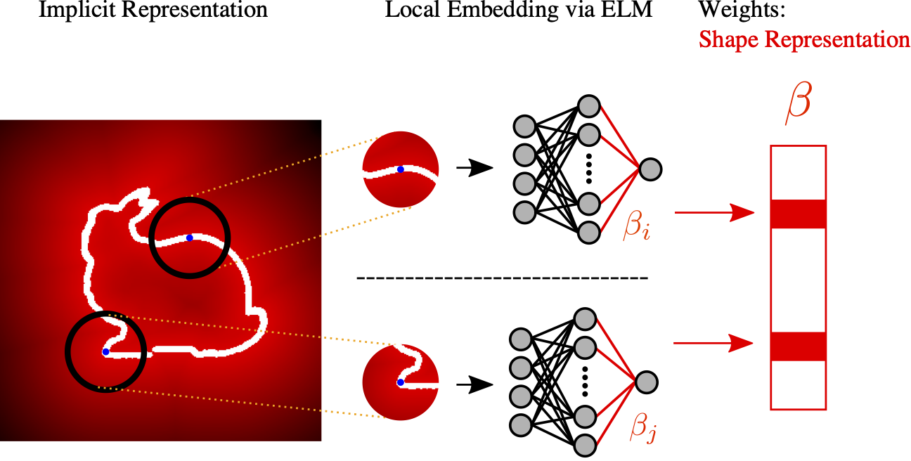

# Neural Implicit Embedding for Point Cloud Analysis

This is the author's simple implementation of the CVPR 2020 paper:
 [Paper](http://openaccess.thecvf.com/content_CVPR_2020/papers/Fujiwara_Neural_Implicit_Embedding_for_Point_Cloud_Analysis_CVPR_2020_paper.pdf) 

## Overview
We present a novel representation for point clouds that encapsulates the local characteristics of the underlying structure. 

The key idea is to embed an implicit representation of the point cloud, namely the distance field, into neural networks. 



Please contact [Kent Fujiwara](https://kfworks.com) for details.

 ## Requirements

The code requires the following:
* Python 3.6
* Keras 2.3
* CUDA 10.1
* cudnn 7
* cupy
* threading

## Usage

To run the code, simply run
```
python classify.py
```
to conduct classification on ModelNet 40 dataset. Please download the [data](https://shapenet.cs.stanford.edu/media/modelnet40_ply_hdf5_2048.zip), and modify the DATA_DIR and SAVE_DIR to the preferred locations. Please modify both train_files.txt and test_files.txt to only include file names without the extension, e.g. ply_data_train0 

and run
```
python segment.py
```
to conduct segmentation on ShapeNet Parts dataset. Please download the [data](https://shapenet.cs.stanford.edu/ericyi/shapenetcore_partanno_v0.zip) and do the same as above.

Preprocessing data into ELM requires memory space. We recommend splitting the data files into smaller batches if the processing fails.

## Citation
Please cite the following paper:

	@inproceedings{Fujiwara2020Embedding,
	  title={Neural Implicit Embedding for Point Cloud Analysis},
	  author={Fujiwara, Kent and Hashimoto, Taiichi},
	  booktitle={Proceedings of the IEEE Conference on Computer Vision and Pattern Recognition},
	  year={2020}
	}

## License
MIT License

## Reference
Work related to the proposal [Neural Embedding](https://arxiv.org/abs/1809.04820). 